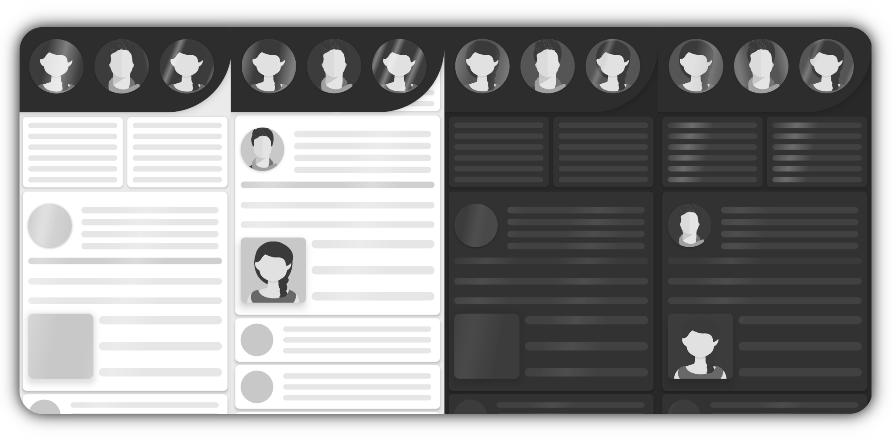

<div align="center">
  
  [banner]: ./media/gifs/section_stripe_white.gif
  [thick-banner]: ./media/gifs/wide_banner_white.gif
  
  ![Banner Demo][thick-banner]
  

[](https://www.android.com)
[](https://android-arsenal.com/api?level=23s)
[](https://opensource.org/licenses/ISC)
[](https://jitpack.io/#EudyContreras/Skeleton-Bones)


  
<h1> Bones </h1>

</div>

Library for dynamically generating and animating skeleton drawables. This library can generate a drawable skeleton loader for any View or ViewGroup. Simply define the desired properties and the skeleton drawable will be generated for the ViewGroup and it's children. It is that simple! Below you ll find information on how to use this library.



<div align="center">
  
# Table of Content
  </div>
  
- **[Features](#features)**
- **[Glossary](#glossary)**
- **[Getting Started](#getting-started)**
- **[ViewGroup Skeleton Attributes](#viewgroup-skeleton-attributes)**
  - **[Skeleton](#skeleton)**
  - **[Bones](#skeleton-bones)**
  - **[Shimmer Rays](#skeleton-shimmer-rays)**
- **[View Bone Attributes](#view-bone-attributes)**
  - **[Bones](#bone)**
  - **[Bone Shimmer Rays](#bone-shimmer-rays)**
- **[Using a Property Holder](#using-a-property-holder)**
  - **[Property Bones](#property-bone)**
  - **[Property Shimmer Rays](#property-shimmer-rays)**
- **[Resources](#resources)**
- **[How can I use in my project?](#how-can-i-use-in-my-project)**
  - **[Step 1](#step-1)**
  - **[Step 2](#step-2)**
  - **[Step 2](#example-usage)**
- **[ViewGroup Skeleton Attributes](#viewgroup-skeleton-attributes)**
- **[How does it work?](#how-does-it-work)**
- **[Caveats, limitations and notes?](#caveats-limitations-and-notes)**
- **[Future plans](#future-plans)**
- **[Contribute](#contribute)**
- **[Contact](#contact)**
- **[Disclaimers](#disclaimer)**
- **[License](#license)**

<div align="center">
  
![Header Banner][banner] 
# Glossary
</div>

**Skeleton**: A drawable loader representation of a ViewGroup. The skeleton is the wrapper around the generated bones where each bone represents a view within the ViewGroup. The skeleton is in charge of managing and rendering each of the bones generated for each non-ignored view within the owner layout. Skeleton drawables are recommended over single Bone Drawables when possible since the a single drawable is used for representing a complex layout. The skeleton drawable is created and overlaid over the layout in order to render the bones and the visible shimmers. See [**Shimmer Rays**](./docs/elements/BONE_SHIMMER_RAY.md), See [**Skeleton**](./docs/elements/SKELETON.md)


**Skeleton Bone**: A bone drawable loader representation of a View. Bones are typically contained within a skeleton, but bones can also be on their own. When a bone is contained within a parent that is a SkeletonDrawable, the parent drawable is in charge of the rendering of said bone. Every detail of the bone can be customized in order to provide the best look. When a bone is not contained within a Skeleton, the bone is then an independent bone and has similar but limited functionality. The bone can have its own state and can display an overlay shimmer. Below you ll find a list of properties that can be customized. Independent bones can share properties through a [**BonePropertyHolder**](#using-a-property-holder), See [**Skeleton Bones**](./docs/elements/SKELETON_BONE.md)


**Shimmer Ray**: The effect that overlays a skeleton or bone in order to communicate to the user that the View or ViewGroup is currently loading. Shimmer rays can be applied to both Skeletons and individual bones. Most aspects of the shimmer rays can be customized. See [**Shimmer Rays**](./docs/elements/BONE_SHIMMER_RAY.md)
<br/>
<br/>

<div align="center">
  
![Banner Demo][banner]
# Features
</div>

* Lightweight and easy to use
* Non-invasive, No changes to existing code required.
* No layout nor view wrapping which creates complex hierarchies
* No mock layouts needed
* Pixel perfect skeleton bone placing
* Disposed when no longer needed
* No boilerplate
* Uses data binding
* Highly performant
* Extremely customizable
* Code-free use
<br/>

<div align="center">

![Header Banner][banner] 
# Getting started
</div>

**Bones** is highly customizable and provides you the freedom of creating concise skeletons that will fit your apps design seamlessly. Although the recommended way of using bones is to apply it and modify it using data-binding, it is possible to customize Bones by directly accessing its properties through an instance. Bones can be customized by creating a instance of a **`SkeletonDrawable`** or **`BoneDrawable`** and directly applying the desired properties to it. The properties can be modified using both builder and property accessors patterns.


**You can use the available extension function**


```kotlin
val viewGroup: ViewGroup = getSomeContainer()
   
viewGroup.applySkeletonDrawable().apply {  }
```

**Use the builder pattern by calling build on the instance of the drawable**


```kotlin
val viewGroup: ViewGroup = getSomeContainer()
   
SkeletonDrawable.create(viewGroup)
  .build()
  .setEnabled(true)
  .setAllowSavedState(true)
  .withShimmerBuilder { 
      setThickness(10.dp)
      setTilt(0.3f)
  }
  .setCornerRadius(10f)
```

**You can use accessor patterns**


```kotlin
val viewGroup: ViewGroup = getSomeContainer()

SkeletonDrawable.create(viewGroup).apply { 
    this.getProps().apply {
        this.enabled = true
        this.allowSavedState = true
        this.shimmerRayProperties.apply { 
            this.shimmerRayThickness = 10.dp
            this.shimmerRayTilt = 0.3f
        }
    }
}
```

The recommended way of applying a skeleton drawable is by using **Bone's** data-binding properties/attributes. Here are the lists of the main properties that can be applied in order to achieve a desirable effect.
<br/>
<br/>

<div align="center">
  
  ![Header Banner][banner] 
# ViewGroup Skeleton Attributes
</div>

These are the properties that can be access through any ViewGroup. Although, some of the following properties will also work when set from a View, the behaviour will be different.

* Properties that start with `skeleton` are applied to the actual skeleton **`ViewGroup`** which generates the bones. 
* Properties that start with `skeletonBone` are applied to the children bone (Views) of the skeleton.
* Properties that start with `skeletonShimmerRay` are applied to the shimmer ray of the skeleton **`ViewGroup`**

<div align="center">
<br/>
  
### Skeleton

| Property | Description |
|:----------|:-----------|
|**app:skeletonEnabled** | Determines whether the skeleton loading drawable should be shown.|
|**app:skeletonBackgroundColor** | Determines the background color of the drawable.|
|**app:skeletonCornerRadius** | Sets the corner radius for this skeleton. |
|**app:skeletonLayoutIgnored** | Determines if the target layout's children should be ignored|
|**app:skeletonGenerateBones** | When false bones are not generated. Useful to show shimmer rays only.|
|**app:skeletonAllowSavedState** | Preserves the internal state of the skeleton representation.|
|**app:skeletonAllowWeakSavedState** |Weakly preserves the internal state of the skeleton representation.|
|**app:skeletonDissectLargeBones** | Dissects bones which exceed max set thickness |
|**app:skeletonUseStateTransition** | Determines the state transition duration for the skeleton drawable.|
|**app:skeletonTransitionDuration** | Determines the transition duration for changing the drawable state.|
|**app:skeletonAnimateRestoredBounds** &nbsp; &nbsp; &nbsp; &nbsp; &nbsp; &nbsp; &nbsp;| Animates bounds restoration for tempered bounds.|
<br/>

### Skeleton Bones

| Property | Description |
|:----------|:-----------|
|**app:skeletonBoneColor** | Determines the color of the bones.|
|**app:skeletonBoneMinThickness** | Sets the min thickness for the bones |
|**app:skeletonBoneMaxThickness** | Sets the max thickness for the bones |
|**app:skeletonBoneCornerRadius**  &nbsp; &nbsp; &nbsp; &nbsp; &nbsp; &nbsp; &nbsp; &nbsp; &nbsp; &nbsp; &nbsp; &nbsp; &nbsp;| Determines the corner radius for rectangular bones. &nbsp; &nbsp; &nbsp; &nbsp; &nbsp; &nbsp; &nbsp; &nbsp; &nbsp; &nbsp;&nbsp; &nbsp;  &nbsp; &nbsp; &nbsp; &nbsp; &nbsp; &nbsp; &nbsp; &nbsp;|
|**app:skeletonBoneToggleView** | When true, bone owner views are hidden while loading. |
<br/>

### Skeleton Shimmer Rays

| Property | Description |
|:----------|:-----------|
|**app:skeletonShimmerRayColor** | Determines the color of the shimmer ray.|
|**app:skeletonShimmerRayTilt** | sets the tilt or skew used for the shimmer rays. Range -1f to 1f|
|**app:skeletonShimmerRayCount** | Sets the amount of shimmer rays that are rendered on the Skeleton.|
|**app:skeletonShimmerRayThickness** | Sets the shimmer ray thickness in pixels.|
|**app:skeletonShimmerRayThicknessRatio** | Sets the shimmer ray thickness in parent skeleton percentage. 1f is full|
|**app:skeletonShimmerRaySpeedMultiplier** | Sets the relative speed at which the rays should shimmer.|
|**app:skeletonShimmerRayInterpolator** | Sets the interpolator that should be use for the shimmer rays|
|**app:skeletonShimmerRaySharedInterpolator** &nbsp; &nbsp; &nbsp; &nbsp;| When true it shares a set interpolator among the shimmer rays|

</div>
  <br/>
  
>Each of the above attributes has documentation. Please consult the **xml docs** by hovering over the attribute in order to get a more detailed description of the attribute. If you rather read more in detail about the properties and about skeletons, please check out this link: [**Skeleton**](./docs/elements/SKELETON.md)

<br/>

<div align="center">
  
  ![Header Banner][banner] 
# View Bone Attributes
</div>

The following are bone properties that can be access through any View. Some of these will not work when set from an independent BoneDrawable since they are meant only for virtually dependent bones within a Skeleton ViewGroup. For more information feel free to consult the Bone document. See [**Skeleton Bones**](./docs/elements/SKELETON_BONE.md)
<br/>

<div align="center">

### Bone

| Property | Description |
|:----------|:-----------|
|**app:skeletonBoneProps** | A reference to a **BoneProperties** object |
|**app:skeletonBoneEnabled** | Enables/Disables the loading state for the bone |
|**app:skeletonBoneColor** |Determines the color of the bone generated for this view|
|**app:skeletonBoneToggleView** | When true, the bone owner view is hidden while loading. |
|**app:skeletonBoneShadeMultiplier** | Sets a shade multiplier use for lightening or darkening the bone color |
|**app:skeletonBoneTranslationX** | Sets a X translation to the generated bone.|
|**app:skeletonBoneTranslationY** | Sets a Y translation to the generated bone.|
|**app:skeletonBoneMinThickness** | Sets the min thickness/height the bone should be clamped at |
|**app:skeletonBoneMaxThickness** | sets the max thickness/height the bone should be clamped at |
|**app:skeletonBoneMatchBounds** | Flags the bone's dimensions to be computed with the owner view's exact bounds.|
|**app:skeletonBoneMinWidth** | Temporally sets the min width of the bone and the owner view |
|**app:skeletonBoneMinHeight** | Temporally sets the min width of the bone and the owner view |
|**app:skeletonBoneWidth** |Determines the width of the bone generated for this view|
|**app:skeletonBoneHeight** |Determines the height of the bone generated for this view|
|**app:skeletonBoneSize** |Determines the width and height of the bone generated for this view|
|**app:skeletonBoneCornerRadius** |Determines the corner radius of the bone generated for this view|
|**app:skeletonBoneShapeType** |Sets the shape type for the generated bone(Rectangular, Circular)|
|**app:skeletonBoneIgnored** | Determines if the view should be ignored during bone generation.|  
|**app:skeletonBoneAllowSavedState** |Preserves the internal state of the bone representation.|
|**app:skeletonBoneAllowWeakSavedState** |Weakly preserves the internal state of the skeleton representation.|
|**app:skeletonBoneDissectLargeBones** | When true, bones which exceed the max thickness/height are dissected|
|**app:skeletonBoneTransitionDuration** | Determines the transition duration for changing the drawable state |
<br/>

### Bone Shimmer Rays

| Property | Description |
|:----------|:-----------|
|**app:skeletonBoneShimmerRayTilt** | sets the tilt or skew used for the shimmer rays.|
|**app:skeletonBoneShimmerRayCount** | Sets the amount of shimmer rays that are rendered on the Skeleton.|
|**app:skeletonBoneShimmerRayThickness** | Sets the shimmer ray thickness in pixels.|
|**app:skeletonBoneShimmerRayThicknessRatio** | Sets the shimmer ray thickness in parent skeleton percentage.|
|**app:skeletonBoneShimmerRaySpeedMultiplier** | Sets the relative speed at which the rays should shimmer.|
|**app:skeletonBoneShimmerRayInterpolator** | Sets the interpolator that should be use for the shimmer rays|
|**app:skeletonBoneShimmerRaySharedInterpolator** | When true it shares a set interpolator among the shimmer rays|


</div>

<br/>

>Each of the above attributes has documentation. Please consult the **xml docs** by hovering over the attribute in order to get a more detailed description of the attribute
<br/>
<br/>

<div align="center">
  
  ![Header Banner][banner] 
# Using a Property Holder
</div>

**BonePropertyHolder** This is a fake View that can be added anywhere within the view hierarchy. It has the sole purpose of acting as a property holder that can later be referenced by any View (Bone). The bone created for that view will then clone the properties of the BonePropertyHolder in order to define its own properties. This is usually done when multiple views share a same independent style or behaviour.

The BoneProperty holder can make use of the following properties. For a detailed description of the properties and their effects please refer to the property guide. 
<br/>

<div align="center">

### Property Bone

| Property | Description | Default
|:----------|:-----------|:---------:|
|**app:bonePropId** |The id of the property holder. Needed for referencing this holder.| **`null`**|
|**app:bonePropColor** | Sets the bone color property. | **`null`**|
|**app:boneToggleView** |  When true, the bone owner view is hidden while loading | **`true`** |
|**app:bonePropCornerRadius** | Sets the corner radius property. | **`null`**| 
|**app:bonePropDissectLargeBones** | Sets the dissect large bones property. | **`null`**|
|**app:bonePropTransitionDuration** | Sets state change animation duration property. | **`null`**|
|**app:bonePropAllowSavedState** | Sets the internal state preservation state flag. | **`null`**|
|**app:bonePropAllowWeakSavedState** &nbsp; &nbsp;&nbsp; &nbsp; &nbsp; &nbsp;| Sets the internal state weak preservation state flag. | **`null`**|
<br/>

### Property Shimmer Rays
| Property | Description | Default
|:----------|:-----------|:---------:|
|**app:bonePropShimmerRayColor** | Sets the shimmer ray color property. | **`White`** |
|**app:bonePropShimmerRayTilt** | sets the shimmer ray tilt/skew property| **`-0.3f`**|
|**app:bonePropShimmerRayCount** | sets the shimmer ray count property| **`0`**|
|**app:bonePropShimmerRayThickness** | sets the shimmer ray thickness property| **`null`**|
|**app:bonePropShimmerRayThicknessRatio** | sets the shimmer ray thickness ratio property| **`0.45f`**|
|**app:bonePropShimmerRaySpeedMultiplier** | sets the shimmer ray animation speed multiplier| **`null`**|
|**app:bonePropShimmerRayInterpolator** | sets the interpolator property| **`FOSI`** |
|**app:bonePropShimmerRaySharedInterpolator** &nbsp; &nbsp; &nbsp; &nbsp; &nbsp;| sets the shared interpolator property&nbsp; &nbsp; &nbsp; &nbsp; &nbsp; &nbsp; &nbsp; &nbsp; &nbsp; &nbsp; &nbsp; &nbsp; &nbsp; &nbsp; &nbsp; &nbsp; &nbsp; &nbsp;| **`null`**|

</div>

<br/>

>A view can refer to a **BonePropertyHolder** using its id through the **`app:skeletonBonePropId`** attribute. In order to override the properties set in the referenced property holder, the attributes must be prepended with `prop_`. Example: **`app:prop_skeletonBoneColor`**
<br/>
<br/>

<div align="center">
  
  ![Header Banner][banner] 
# Resources
</div>

For a more thorough guides and descriptions please look at the following links:  

[**Skeleton**](./docs/elements/SKELETON.md) Contains information about skeletons and their properties  

[**Skeleton Bones**](./docs/elements/SKELETON_BONE.md) Contains information about bones and their properties  

[**Shimmer Rays**](./docs/elements/SHIMMER_RAY.md) Contains information about shimmer rays and their properties
<br/>
<br/>

<div align="center">
  
 ![Header Banner][banner] 
# How can I use in my project?
</Div>

[](https://jitpack.io/#EudyContreras/Skeleton-Bones)

### Step 1

Add it in your root build.gradle at the end of repositories:

``` gradle
allprojects {
  repositories {
    maven { url 'https://jitpack.io' }
  }
}
```

Add as a dependency in you applications build.gradle.

``` gradle
dependencies {
  implementation 'com.github.EudyContreras:Skeleton-Bones:${lib_version}'
}
```

### Step 2

Refer to a skeleton from any **`ViewGroup`** in order to apply a Skeleton effect to it and its child views

### Example Usage:

```xml
<androidx.constraintlayout.widget.ConstraintLayout
    android:layout_width="match_parent"
    android:layout_height="wrap_content"
    android:background="@drawable/background"
    android:elevation="4dp"
    app:skeletonAnimateRestoredBounds="@{true}"
    app:skeletonAllowSavedState="@{true}"
    app:skeletonBoneColor="@{@color/bone_color}"
    app:skeletonBoneCornerRadius="@{Utils.getDp(10)}"
    app:skeletonBoneMaxThickness="@{Utils.getDp(12)}"
    app:skeletonBoneMinThickness="@{Utils.getDp(10)}"
    app:skeletonDissectLargeBones="@{false}"
    app:skeletonEnabled="@{viewModel.loading}"
    app:skeletonGenerateBones="@{true}"
    app:skeletonShimmerRayColor="@{@color/bone_ray_color}"
    app:skeletonShimmerRayCount="@{4}"
    app:skeletonShimmerRayInterpolator="@{@android:interpolator/accelerate_quad}"
    app:skeletonShimmerRaySharedInterpolator="@{true}"
    app:skeletonShimmerRaySpeedMultiplier="@{1f}"
    app:skeletonShimmerRayThickness="@{Utils.getDp(120)}"
    app:skeletonShimmerRayTilt="@{-0.2f}"
    app:skeletonTransitionDuration="@{200L}"
    app:skeletonUseStateTransition="@{true}"
    tools:background="@color/white">
</androidx.constraintlayout.widget.ConstraintLayout>
```
<br/>

<div align="center">

![Header Banner][banner] 
# How does it work?
</div>

The library works by creating a drawable based on some **`View`** or **`ViewGroup`**. The drawable can listen to a state using data-binding. When the state is true the skeleton loader drawable is shown and animated if it has any shimmers added to it. Each skeleton drawable has a skeleton object and a skeleton manager which is in charge for manipulating the skeleton, the bones and the shimmer rays. Same applies to BoneDrawables. The skeleton is visually created based on the ViewGroup/View that the drawable was bound to and then added as an overlay. The skeleton loader drawables are added as temporary foreground drawables. Once the state of the loader changes to false, the skeleton or bone drawable is removed and the original foreground is restored given that one was previously present.

<br/>

<div align="center">
  
![Header Banner][banner] 
# Caveats, Limitations and Notes
</div>

**BEWARE** In order for the skeleton and bone drawables to be properly generated, there **must** be some pre-determined minimum set dimensions **(Width and Height)** for the none ignored children. This is needed in order to know how to visually build the bone representations of said children views.

Setting dimensions using the **`android:minWidth`** and/or the **`android:minHeight`** should suffice. Otherwise if the minWidth and/or minHeight are set using the skeleton binding properties  **`app:skeletonBoneMinWidth`** and **`app:skeletonBoneMinHeight`**, the dimensions will then be applied to the view and restored once the loading state is set to false. (The content has loaded). Additionally restoring the bounds of the view once the content was loaded can be done using layout animations in order to provide a smoother user experience. This is optional and can be done by setting this to true **`skeletonAnimateRestoredBounds`**.
 
When the state of a bone is true (Loading) and if the **`skeletonBoneToggleView`** is set to true, the view which the bone represents is hidden. When this is the case, if the owner view of the bone has an elevation, fake shadows are generated under the bone. This is done to preserve the look and feel. 

If the owner view of a bone does not have valid drawable bounds, meaning its height is less than bone's set minimum height **`skeletonBoneMinThickness`** or if not set, the default minimum thickness which is 10dp, no bone will be generated for it. This is done to avoid generating bones that are too thin or barely visible.
<br/>
<br/>

<div align="center">

![Header Banner][banner] 
# Future plans
</div>

- [ ] Facilitate use with Glide and other popular Image Loaders
- [ ] Allow defining styles for both the Skeleton and Bone drawables
- [ ] Bones should be able to have a set of enter/exit animations
   * Ex: Rectangular bones collapse to the left
   * Ex: Rectangular bones collapse to the center
   * Ex: Circular bones collapse to the center
<br/>

## Contribute

Please read [**Contributing**](./CONTRIBUTING.md) for details about how to contribute, and the process for submitting pull requests to **Bones**

## Authors

**Eudy Contreras**

## Contact

If you wish to contact me, you can reach me through my [**LinkedIn**](https://www.linkedin.com/in/eudycontreras/) or my [**Email**](EudyContrerasRosario@gmail.com)

## Disclaimer 

The avatar images are not created by me. They are amazing and I wanted to use them. If you are the author please contact me.

## License

This project is licensed under the MIT License - see the [**Licence**](./LICENSE) file for details
